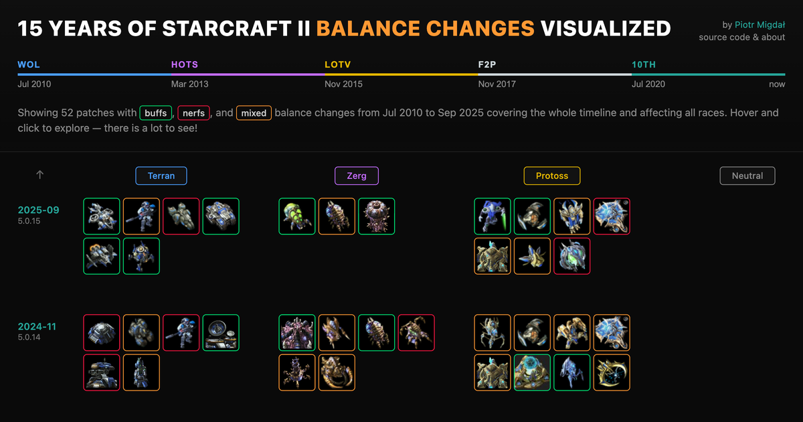

# 15 Years of StarCraft II Balance Changes Visualized

> Never perfect. Perfection goal that changes. Never stops moving. Can chase, cannot catch. — Abathur ([hear it here](https://www.youtube.com/watch?v=pw_GN3v-0Ls))

Visual history of StarCraft II multiplayer balance changes (2010–present), by [Piotr Migdał](https://p.migdal.pl/).

**[Live Demo](https://p.migdal.pl/sc2-balance-timeline/)**

[](https://p.migdal.pl/sc2-balance-timeline/)

## What's inside

- All unit changes
- View by race
- Select an era
- View history of balance changes by year
- Changes characterized as:
  - buffs (anything that makes a unit stronger)
  - nerfs (anything that makes a unit weaker)
  - mixed (well, anything that is a double-edged blade)

If it glows, it is clickable. It should also work on mobile.

Data visualization with D3.js, data extraction with LLM (Gemini 3 Pro).

I decided on a unit-first view. So upgrades and similar changes are attributed to the unit. For the same reason, summoned units are assigned to their parent - Locusts to Swarm Host, Infested Terrans to Infestor, Broodlings to Brood Lord (even though they also appear with destroyed Zerg buildings), etc.

## Data

Data comes from [Blizzard StarCraft II](https://starcraft2.blizzard.com/en-us/), with a lot of supplemental stuff from [Liquipedia](https://liquipedia.net/starcraft2/) ([patch list](https://liquipedia.net/starcraft2), links to unit pages, and validation checks).

It is a visualization of all balance changes from StarCraft II history.

| Era                | Launch   | Patch Range    | First Balance |
| ------------------ | -------- | -------------- | ------------- |
| Wings of Liberty   | Jul 2010 | 1.1.0 - 1.5.4  | Sep 2010      |
| Heart of the Swarm | Mar 2013 | 2.0.8 - 2.1.9  | May 2013      |
| Legacy of the Void | Nov 2015 | 3.1.1 - 3.14.0 | Jan 2016      |
| Free-to-Play       | Nov 2017 | 4.0 - 4.12.0   | Nov 2017      |
| 10th Anniversary   | Jul 2020 | 5.0.2 - 5.0.15 | Aug 2020      |

As of now, there are 49 balance patches.

I only show patches that affect multiplayer balance - excluding all changes for campaign, co-op, bug fixes, and other adjustments which are not directly for typical ranked games.

Also, I didn't include balance for pre-release tests, as they were too rapid, more like a creative process of unit design than something actually released. Also - for some of these changes, original pages might be unavailable. THough, if there is significant demand, I may consider adding beta changes.

There are around 39 beta patches:

- WoL Beta: 0.3.0 - 0.20.0
- HotS Beta: Updates #1-15
- LotV Beta: 2.5.0 - 2.5.5

### Curious findings

Pre-LotV patches use "Blizzard Time" (1.4× faster than real time); LotV switched to real-time display, explaining apparent numeric jumps like Stimpack research going from 170s to 121s without a balance patch.

### Processing

Most processing happens within Python. The pipeline is as follows:

```
HTML (Blizzard) → LLM Parse → Validate → JSON → D3
```

For parsing, LLMs are essential. I first tried typical scripts, but over so many years the Blizzard page structure changed repeatedly. Using classical scraping scripts didn't scale well.

Manual input would work... but it is also why only now I started this project (the idea was old).

I use [Gemini 3 Pro](https://openrouter.ai/google/gemini-3-pro-preview) via [OpenRouter](https://openrouter.ai/) (tested Claude Opus 4.5, GPT-5.2, Gemini 3 Flash — Gemini 3 Pro seems to work the best for this data).

As side note, see my blog post [AI for coding is still playing Go, not StarCraft](https://quesma.com/blog/coding-is-starcraft-not-go/).

## Running locally

For running vis, you need [pnpm](https://pnpm.io/):

```bash
cd visualization
pnpm install
pnpm dev
```

For parsing and building data, you need Python with [uv](https://docs.astral.sh/uv/).

Copy `.env.example` to `.env` and add your `OPENROUTER_API_KEY`.

```bash
uv sync
uv run python sc2patches/pipeline/1_download.py
uv run python sc2patches/pipeline/2_parse.py
uv run python sc2patches/pipeline/3_validate.py
uv run python sc2patches/pipeline/4_export_for_viz.py
```

Most of the development was done with Claude Code and Opus 4.5. See [my blog post praising Claude Code + Gemini](https://quesma.com/blog/claude-skills-not-antigravity/).

### Structure

```
├── sc2patches/        # Python package
│   ├── pipeline/      # Main scripts (1-4)
│   ├── core/          # Library code
│   └── tools/         # Utility scripts
├── data/              # Source URLs, processed JSON
└── visualization/     # React frontend
```

## License

MIT by [Piotr Migdał](https://p.migdal.pl/) - processing code and data viz

---

_StarCraft II and Blizzard Entertainment are trademarks of Blizzard Entertainment, Inc._ Unit icons are assets of Blizzard.

## Thanks

I am grateful to [Jasmine Otto](https://jazztap.github.io/) for valuable feedback on an early draft.
